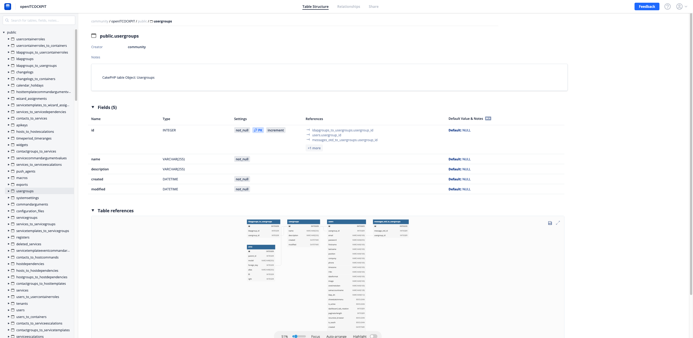
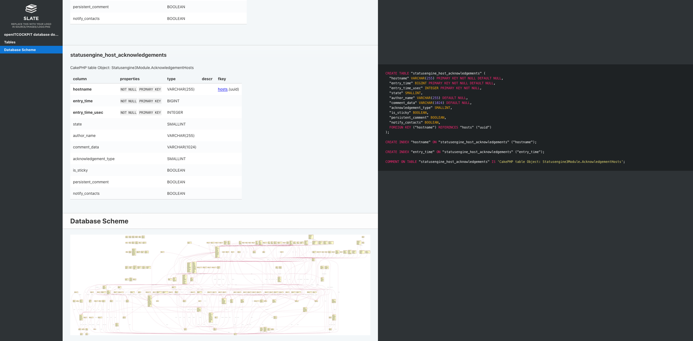
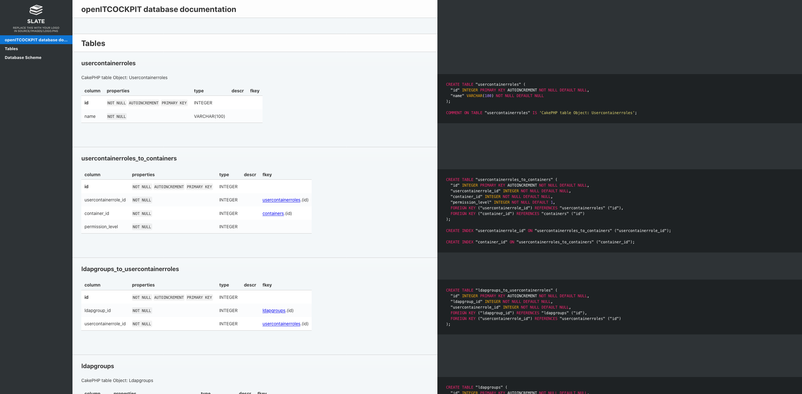

# openITCOCKPIT-dbschema
This repository contains the database documentation of openITCOCKPIT.
By default, openITCOCKPIT supports MySQL or MariaDB as database server.

The database schema is in [DBML](https://www.dbml.org) (Database Markup Language) format.

## Hosted version
The latest database documentation is online available at https://dbdocs.io/community/openITCOCKPIT
This version gets frequently updated by the openITCOCKPIT team.



## Generate DBML file
The openITCOCKPIT CLI provides a method to generate a fresh version of the currently used database schema as DBML file.
*Requires openITCOCKPIT >= 4.4.1*
```
oitc Dbml.generate --se
```

## Self-hosted version with Foliant
If preferred you can host your own copy of the documentation using `Foliant`

Download a `.dbml` file from this repository or generate a new one like described above.


```
git clone https://github.com/it-novum/openITCOCKPIT-dbschema.git
cd openITCOCKPIT-dbschema/foliant

docker-compose build

cp /opt/openitc/frontend/tmp/cli/database.dbml schema.dbml

# You can also replace slate with mkdocs if preferred
docker-compose run --rm foliant make site --with slate
```

### Run webserver

```
docker run --rm -it --name my-apache-app -p 9999:80 -v "$PWD/openITCOCKPIT_database_documentation-$(date +'%Y-%m-%d').slate":/usr/local/apache2/htdocs/ httpd:2.4
```

Open `http://127.0.0.1:9999` or `http://<server-address>:9999` in your Browser.




### Mkdocs or alternative backends
Foliant also supports other backends like mkdocs.
```
root@dev-foca:~/openITCOCKPIT-dbschema/foliant# docker-compose run --rm foliant make site
Creating foliant_foliant_run ... done
Please pick a backend from ['aglio', 'mdtopdf', 'mkdocs', 'slate']:
```

More information can be found in the Foliant documentation: https://foliant-docs.github.io/docs/tutorials/db/dbml/

> openITCOCKPIT and it's developers are in no way associated to [dbdiagram](https://dbdiagram.io/), [dbdocs](https://dbdocs.io/) or [Foliant](https://foliant-docs.github.io/docs/) 